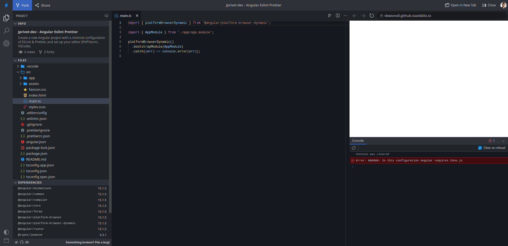
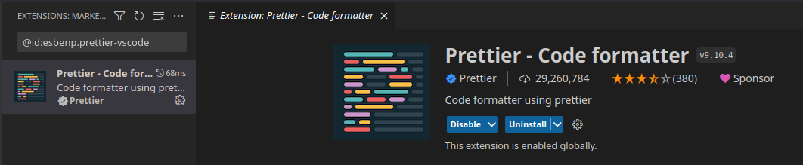
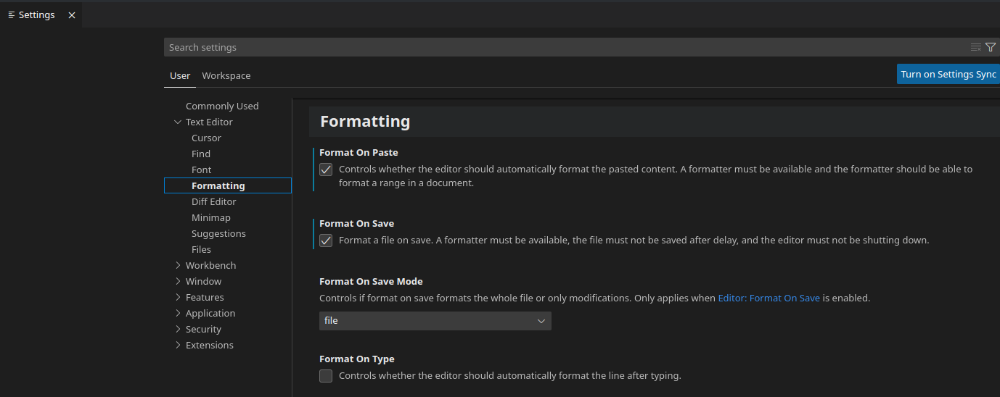

:toc: macro
:toc-title: Summary
:toclevels: 3
:numbered:

ifndef::env-github[:icons: font]
ifdef::env-github[]
:status:
:outfilesuffix: .adoc
:caution-caption: :fire:
:important-caption: :exclamation:
:note-caption: :paperclip:
:tip-caption: :bulb:
:warning-caption: :warning:
endif::[]

:back_to_top_target: top-target
:back_to_top_label: ⬆ Back to top
:back_to_top: <<{back_to_top_target},{back_to_top_label}>>

:main_title: Angular, Eslint, Prettier & Editors
:git_project: angular-eslint-prettier
:git_username: jprivet-dev
:git_url: https://github.com/{git_username}/{git_project}
:git_clone_ssh: git@github.com:{git_username}/{git_project}.git
:stackblitz_from_github: https://stackblitz.com/github/{git_username}/{git_project}/tree/main/app

// Releases
:project_release: v1.1501.2.0
:node_release: v18.13.0
:npm_release: 8.19.3
:angular_release: 15.1.5
:schematics_release: 15.2.1
:prettier_release: 2.7.1
:phpstorm_release: 2022.3.2
:vscode_release: 1.75.1

[#{back_to_top_target}]
= {main_title}

image:https://badgen.net/badge/release/{project_release}/blue[Project release,link={git_url}/releases/tag/{project_release}]
image:https://badgen.net/badge/angular/{angular_release}/d93630[Angular release,link=https://github.com/angular/angular/releases/tag/{angular_release}]
image:https://developer.stackblitz.com/img/open_in_stackblitz_small.svg[Open in StackBlitz,link={stackblitz_from_github}]

toc::[]

== Presentation

Create a new Angular project with a minimal configuration of ESLint & Prettier, set up your editor (PHPStorm, VSCode) and launch the project in StackBlitz.

Versions used :

|===
| Label | Version

| node | {node_release}
| npm | {npm_release}
| Angular | {angular_release}
| @angular-eslint/schematics | {schematics_release}
| Prettier | {prettier_release}
| PHPStorm | {phpstorm_release}
| VS Code | {vscode_release}
|===

{back_to_top}

== Prerequisites

=== Install NVM or Node

To launch locally that project, you will need to install NVM (Node Version Manager) or Node.

[NOTE]
====
More information on:

* NVM: https://github.com/nvm-sh/nvm
* Node: https://nodejs.org/en/download
====

In my case, I used Node in KDE Neon (see https://github.com/nodejs/snap).

{back_to_top}

=== Install a global Angular CLI (optional) [[install-global-angular-cli]]

If you want to regenerate step by step a new Angular project, you will need to install/update a global Angular CLI:

```
$ npm install -g @angular/cli
```

NOTE: More information on https://angular.io/cli

{back_to_top}

== Installation

. `$ git clone {git_clone_ssh}`
. `$ cd {git_project}/app`
. `$ npm install`
. `$ ng serve`
. Open your browser on http://localhost:4200/

After installation, you can <<set-up-your-editor>>.

{back_to_top}

== StackBlitz

=== Launching the project

image:https://developer.stackblitz.com/img/open_in_stackblitz.svg[Open in StackBlitz,link={stackblitz_from_github}]

NOTE: More information on https://developer.stackblitz.com/guides/integration/open-from-github

{back_to_top}

=== Avoid error with `zone.js`

Angular CLI generates the `main.ts` file without `zone.js`:

.main.ts
```typescript
import { platformBrowserDynamic } from '@angular/platform-browser-dynamic';

import { AppModule } from './app/app.module';

platformBrowserDynamic().bootstrapModule(AppModule)
  .catch(err => console.error(err));
```

Locally everything works fine with `$ ng serve`, but this creates the following error in StackBlitz:

```
Error: NG0908: In this configuration Angular requires Zone.js
```



So to fix this, I have to import `zone.js` in `main.ts`:

.main.ts
```typescript
import 'zone.js/dist/zone'; // Avoid error in StackBlitz
import { platformBrowserDynamic } from '@angular/platform-browser-dynamic';

import { AppModule } from './app/app.module';

platformBrowserDynamic().bootstrapModule(AppModule)
  .catch(err => console.error(err));
```

After that, everything worked perfectly!

image::doc/stackblitz-zone-ok.png[]

[NOTE]
====
More information on:

* https://github.com/manfredsteyer/ngx-build-plus/issues/4#issuecomment-613988290
* https://github.com/jprivet-dev/angular-stackblitz
====

{back_to_top}

== Create your Angular project step by step

[TIP]
====
It is possible to create the content of the `{git_project}/app` folder, from scratch.

To do this, just remove `{git_project}/app` folder and generate a new Angular projet in `{git_project}` : the `/app` folder will be regenerated by Angular CLI.
====

=== Case 1: Generate a new Angular app using directly ESlint schematics & use Prettier

==== Step #1: Remove the old Angular app

```
$ [[ -d app ]] && rm -rf app
```

{back_to_top}

==== Step #2: Generate an empty Angular workspace

NOTE: Prerequisites: <<install-global-angular-cli>>

```
$ ng new app --create-application false --defaults
$ cd app
```

{back_to_top}

==== Step #3: Install ESLint

```
$ ng add @angular-eslint/schematics
```

[TIP]
====
If you have that error:

```
✔ Packages successfully installed.
NOT SUPPORTED: keyword "id", use "$id" for schema ID
```

Execute the following command (the `next` tag is used by some projects to identify the upcoming version):

```
$ ng add @angular-eslint/schematics@next
```

More information on:

* https://github.com/angular-eslint/angular-eslint/issues/790#issuecomment-962988420.
* https://docs.npmjs.com/cli/v9/commands/npm-dist-tag#purpose
====

At the end of the process, you will get a confirmation message:

```
...
CREATE .eslintrc.json (984 bytes)
UPDATE package.json (1451 bytes)
UPDATE angular.json (3456 bytes)
✔ Packages installed successfully.
```

{back_to_top}

==== Step #4: Generate a new Angular app in the workspace using ESLint

```
$ ng generate @angular-eslint/schematics:application app --project-root --routing --style scss --defaults --strict
```

{back_to_top}

==== Step #5: Install Prettier locally

```
$ npm install --save-dev --save-exact prettier
$ echo {} >.prettierrc.json
$ cp .gitignore .prettierignore
```

TIP: Base your `.prettierignore` on `.gitignore` and `.eslintignore` (if you have one).

NOTE: More information on https://prettier.io/docs/en/install.html

{back_to_top}

==== Step #6: Format all files with Prettier

```
$ npx prettier --write .
```

==== Script available

Automatically execute all the above commands, in the `{git_project}` folder, with the following script:

```
$ . scripts/generate-app.sh
```

{back_to_top}

=== Case 2: Create an original Angular app, convert TSLint to ESlint & use Prettier

==== Step #1: Remove the old Angular app

```
$ [[ -d app ]] && rm -rf app
```

==== Step #2: Create an Angular app

NOTE: Prerequisites: <<install-global-angular-cli>>

```
$ ng new app --skip-git true --routing --style scss --defaults --strict
$ cd app
```

==== Step #3: Install ESLint

```
$ ng add @angular-eslint/schematics
```

[TIP]
====
If you have that error:

```
✔ Packages successfully installed.
NOT SUPPORTED: keyword "id", use "$id" for schema ID
```

Execute the following command (the `next` tag is used by some projects to identify the upcoming version):

```
$ ng add @angular-eslint/schematics@next
```

More information on:

* https://github.com/angular-eslint/angular-eslint/issues/790#issuecomment-962988420.
* https://docs.npmjs.com/cli/v9/commands/npm-dist-tag#purpose
====

At the end of the process, you will get a confirmation message:

```
...
CREATE .eslintrc.json (984 bytes)
UPDATE package.json (1451 bytes)
UPDATE angular.json (3456 bytes)
✔ Packages installed successfully.
```

{back_to_top}

==== Step #4: Convert TSLint to ESlint

```
# Avoid error: Path "/tslint.json" does not exist.
$ echo {} >tslint.json

$ ng g @angular-eslint/schematics:convert-tslint-to-eslint
```

At the end of the process, you will get a confirmation message:

```
...
DELETE tslint.json
UPDATE angular.json (3456 bytes)
UPDATE package.json (1451 bytes)
✔ Packages installed successfully.
```

{back_to_top}

==== Step #5: Install Prettier locally

```
$ npm install --save-dev --save-exact prettier
$ echo {} >.prettierrc.json
$ cp .gitignore .prettierignore
```

TIP: Base your `.prettierignore` on `.gitignore` and `.eslintignore` (if you have one).

NOTE: More information on https://prettier.io/docs/en/install.html

{back_to_top}

==== Step #6: Format all files with Prettier

```
$ npx prettier --write .
```

{back_to_top}

==== Script available

Automatically execute all the above commands, in the `{git_project}` folder, with the following script:

```
$ . scripts/convert-app.sh
```

{back_to_top}

== Set up your editor [[set-up-your-editor]]

=== PHPStorm

==== Install PHPStorm

PhpStorm is a cross-platform IDE that provides consistent experience on the Windows, macOS, and Linux operating systems.

NOTE: More information on https://www.jetbrains.com/help/phpstorm/installation-guide.html

{back_to_top}

==== Configure a local Node.js interpreter [[configure-a-local-node-js-interpreter]]

TIP: In my case I use Node.

Configure in *Settings > Languages & Frameworks > Node.js*. PHPStorm automatically finds Node and NPM:

image::doc/phpstorm-settings-node-interpreter.png[]

If you use `NVM`, you can have (for example):

* Node interpreter: `~/.nvm/versions/node/v16.15.1/bin/node`
* Package manager: `npm ~/.nvm/versions/node/v16.15.1/bin/npm`

NOTE: More information on https://www.jetbrains.com/help/phpstorm/developing-node-js-applications.html#ws_node_configure_local_node_interpreter.

{back_to_top}

==== Configure ESLint

CAUTION: Before you start: <<configure-a-local-node-js-interpreter>>.

Configure in *Settings > Languages & Frameworks > JavaScript > Code Quality Tools > ESLint* :

image::doc/phpstorm-settings-eslint.png[]

After the configuration, you can see the ESLint alerts in your code. For example:

image::doc/phpstorm-settings-eslint-error.png[]

NOTE: More information on https://www.jetbrains.com/help/phpstorm/eslint.html

{back_to_top}

==== Configure Prettier

CAUTION: Before you start: <<configure-a-local-node-js-interpreter>>.

Configure in *Settings > Languages & Frameworks > JavaScript > Prettier* :

image::doc/phpstorm-settings-prettier.png[]

NOTE: More information on https://www.jetbrains.com/help/phpstorm/prettier.html

{back_to_top}

==== Reformat with Prettier: From the contextual menu

After the configuration, you can reformat your code :

* With the shortcut *Ctrl+Alt+Maj+P*.
* From the contextual menu (*Right click > Reformat with Prettier*).

image::doc/phpstorm-settings-prettier-contextual-menu.png[]

==== Reformat with Prettier: On save

To reformat on save, Go in *Settings > Languages & Frameworks > JavaScript > Prettier*, and check *On save* option:

image::doc/phpstorm-settings-prettier-on-save.png[]

If you click on *All actions on save...*, you will see the list of all activated actions:

image::doc/phpstorm-settings-tools-actions-on-save.png[]

TIP: I also use the *Optimize import* option. This removes unused imports and organizes import statements in the current file. See https://www.jetbrains.com/help/phpstorm/creating-and-optimizing-imports.html#optimize-imports.

{back_to_top}

=== VS Code

==== Install VS Code

Visual Studio Code is a code editor redefined and optimized for building and debugging modern web and cloud applications.  Visual Studio Code is free and available on your favorite platform - Linux, macOS, and Windows.

NOTE: More information on https://code.visualstudio.com/

==== Install ESLint

Install the _ESLint_ extension of Microsoft: https://marketplace.visualstudio.com/items?itemName=dbaeumer.vscode-eslint.

image::doc/vscode-eslint-install.png[]

==== Configure ESLint

After the installation, you can immediately see the ESLint alerts in your code. For example:

image::doc/vscode-eslint-alert.png[]

{back_to_top}

==== Install Prettier

Install the _Prettier - Code formatter_ extension: https://marketplace.visualstudio.com/items?itemName=esbenp.prettier-vscode.



{back_to_top}

==== Reformat with Prettier: From the contextual menu

After the installation, you can reformat your code :

* With the shortcut *Ctrl+Alt+I*.
* From the contextual menu (*Right click > Format Document*).

image::doc/vscode-format-document.png[]

If you have an alert *Configure Default Formatter*:

image::doc/vscode-alert-configure-default-formatter.png[]

Click on the button *Configure...* and select *Prettier - Code formatter*:

image::doc/vscode-select-default-formatter.png[]

==== Reformat with Prettier: On save

To reformat on save, go on *File > Preferences > Settings [Ctrl+,]*, and choose *Text Editor > Formatting*. Check *Format On Paste* and *Format On Save*:



From now on, whenever you paste code or save, the code will be reformatted.

Before:

image::doc/vscode-reformat-before.png[]

After (on paste code or save):

image::doc/vscode-reformat-after.png[]

{back_to_top}

== Semantic Versioning

NOTE: Based on https://semver.org/

```
v[MAJOR].[ANGULAR_VERSION].[MINOR].[PATCH]

With [ANGULAR_VERSION] = [ANGULAR MAJOR + ANGULAR MINOR]
```

Example, with `v1` of this repository with `Angular 15.1.6`:

```
v1.1501.0.0
```

{back_to_top}

== Resources

=== NVM & Node

* https://github.com/nvm-sh/nvm
* https://nodejs.org/en/download

=== Angular, ESLint & Prettier

* https://blog.ninja-squad.com/2021/03/31/migrating-from-tslint-to-eslint/
* https://github.com/typescript-eslint/tslint-to-eslint-config
* https://github.com/angular-eslint/angular-eslint#migrating-an-angular-cli-project-from-codelyzer-and-tslint
* https://www.npmjs.com/package/@angular-eslint/schematics
* https://github.com/angular-eslint/angular-eslint/issues/790#issuecomment-962988420

=== PHPStorm

* https://www.jetbrains.com/help/phpstorm/developing-node-js-applications.html#ws_node_configure_local_node_interpreter
* https://www.jetbrains.com/help/phpstorm/eslint.html
* https://www.jetbrains.com/help/phpstorm/prettier.html
* https://www.jetbrains.com/help/phpstorm/creating-and-optimizing-imports.html#optimize-imports

=== VS Code

* https://marketplace.visualstudio.com/items?itemName=dbaeumer.vscode-eslint
* https://marketplace.visualstudio.com/items?itemName=esbenp.prettier-vscode
* https://khalilstemmler.com/blogs/tooling/prettier/

=== StackBlitz

* https://developer.stackblitz.com/guides/integration/open-from-github

{back_to_top}

== License

This repository is released under the {git_url}/blob/v14.x/LICENSE[*MIT License*]

---

{back_to_top}
