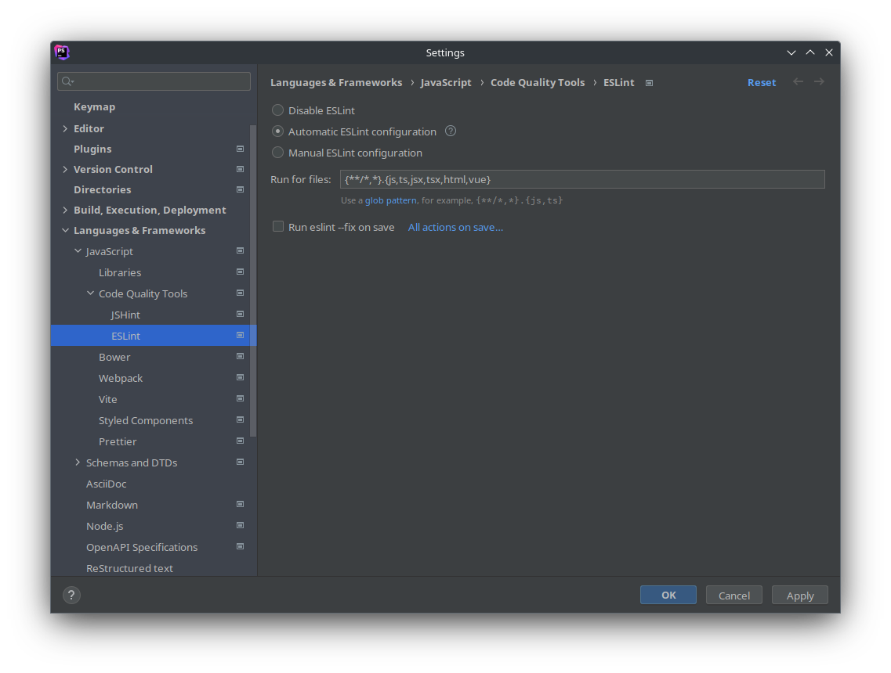
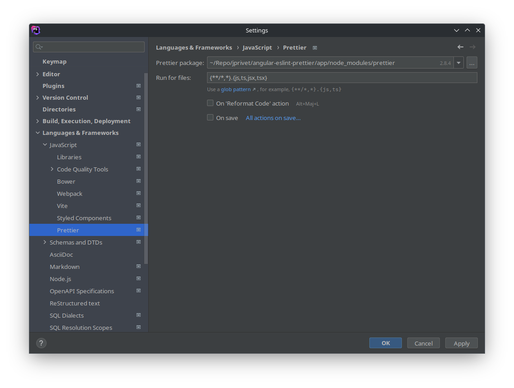
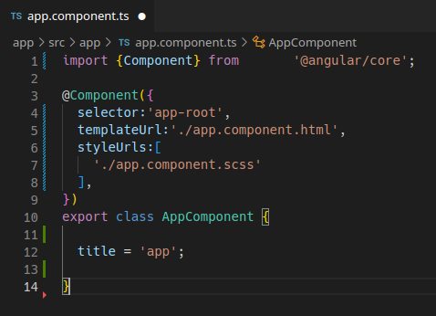

:toc: macro
:toc-title: Summary
:toclevels: 3
:numbered:

ifndef::env-github[:icons: font]
ifdef::env-github[]
:status:
:outfilesuffix: .adoc
:caution-caption: :fire:
:important-caption: :exclamation:
:note-caption: :paperclip:
:tip-caption: :bulb:
:warning-caption: :warning:
endif::[]

:back_to_top_target: top-target
:back_to_top_label: ⬆ Back to top
:back_to_top: <<{back_to_top_target},{back_to_top_label}>>

:main_title: Angular, Eslint, Prettier & Editors
:git_project: angular-eslint-prettier
:git_username: jprivet-dev
:git_url: https://github.com/{git_username}/{git_project}
:git_clone_ssh: git@github.com:{git_username}/{git_project}.git

// Releases
:project_release: v0.0.0-alpha.0
:node_release: v18.13.0
:angular_release: 15.1.6
:shematics_release: 15.1.6
:prettier_release: 2.7.1
:phpstorm_release: 2022.3.2
:vscode_release: 1.67.2

[#{back_to_top_target}]
= {main_title}

image:https://badgen.net/badge/release/{project_release}/blue[Project release,link={git_url}/releases/tag/{project_release}]
image:https://badgen.net/badge/angular/{angular_release}/d93630[Angular release,link=https://github.com/angular/angular/releases/tag/{angular_release}]

toc::[]

== Presentation

Create a new Angular project with a minimal configuration of ESLint & Prettier, and set up your editor (PHPStormq, VSCode).

Versions used :

|===
| Label | Version

| node | {node_release}
| Angular | {angular_release}
| @angular-eslint/schematics | {shematics_release}
| Prettier | {prettier_release}
| PHPStorm | {phpstorm_release}
| VS Code | {vscode_release}
|===

{back_to_top}

== Prerequisites

=== NVM or Node

First, you will need to install NVM (Node Version Manager) or Node

[NOTE]
====
More information on:

* NVM: https://github.com/nvm-sh/nvm
* Node: https://nodejs.org/en/download
====

In my case, I used Node in KDE Neon (see https://github.com/nodejs/snap):

```
$ node --version
v18.13.0
$ npm --version
8.19.3
```

{back_to_top}

=== Global Angular CLI

To generate a new Angular project, you will need to install/update global Angular CLI:

```
$ npm install -g @angular/cli
```

NOTE: More information on https://angular.io/cli

{back_to_top}

== Installation

. `$ git clone {git_clone_ssh}`
. `$ cd {git_project}/app`
. `$ npm install`
. `$ ng serve`
. Open your browser on http://localhost:4200/

After installation, you can <<set-up-your-editor>>.

{back_to_top}

== Create your Angular project step by step

[TIP]
====
It is possible to create the content of the `{git_project}/app` folder, from scratch.

To do this, just remove `{git_project}/app` folder and generate a new Angular projet in `{git_project}` : the `/app` folder will be regenerated by Angular CLI.
====

=== Case 1: Generate a new Angular app using directly ESlint schematics & use Prettier

==== Step #1: Remove the old Angular app

```
$ [[ -d app ]] && rm -rf app
```

{back_to_top}

==== Step #2: Generate an empty Angular workspace

```
$ ng new app --create-application false --defaults
$ cd app
```

{back_to_top}

==== Step #3: Install ESLint

```
$ ng add @angular-eslint/schematics
```

{back_to_top}

==== Step #4: Generate a new Angular app in the workspace using ESLint

```
$ ng generate @angular-eslint/schematics:application app --project-root --routing --style scss --defaults --strict
```

{back_to_top}

==== Step #5: Install Prettier locally

```
$ npm install --save-dev --save-exact prettier
$ echo {} >.prettierrc.json
$ cp .gitignore .prettierignore
```

TIP: Base your `.prettierignore` on `.gitignore` and `.eslintignore` (if you have one).

NOTE: More information on https://prettier.io/docs/en/install.html

{back_to_top}

==== Step #6: Format all files with Prettier

```
$ npx prettier --write .
```

{back_to_top}

=== Case 2: Create an original Angular app, convert TSLint to ESlint & use Prettier

==== Step #1: Remove the old Angular app

```
$ [[ -d app ]] && rm -rf app
```

==== Step #2: Create an Angular app

```
$ ng new app --skip-git true --routing --style scss --defaults --strict
$ cd app
```

==== Step #3: Install ESLint

```
$ ng add @angular-eslint/schematics
```

If you have that error:

```
✔ Packages successfully installed.
NOT SUPPORTED: keyword "id", use "$id" for schema ID
```

Execute the following command:

```
$ ng add @angular-eslint/schematics@next
```

NOTE: More information on https://github.com/angular-eslint/angular-eslint/issues/790#issuecomment-962988420.

At the end of the process, you will get a confirmation message:

```
...
CREATE .eslintrc.json (984 bytes)
UPDATE package.json (1451 bytes)
UPDATE angular.json (3456 bytes)
✔ Packages installed successfully.
```

{back_to_top}

==== Step #4: Convert TSLint to ESlint

```
# Avoid error: Path "/tslint.json" does not exist.
$ echo {} >tslint.json

$ ng g @angular-eslint/schematics:convert-tslint-to-eslint
```

At the end of the process, you will get a confirmation message:

```
...
DELETE tslint.json
UPDATE angular.json (3456 bytes)
UPDATE package.json (1451 bytes)
✔ Packages installed successfully.
```

{back_to_top}

==== Step #5: Install Prettier locally

```
$ npm install --save-dev --save-exact prettier
$ echo {} >.prettierrc.json
$ cp .gitignore .prettierignore
```

TIP: Base your `.prettierignore` on `.gitignore` and `.eslintignore` (if you have one).

NOTE: More information on https://prettier.io/docs/en/install.html

{back_to_top}

==== Step #6: Format all files with Prettier

```
$ npx prettier --write .
```

{back_to_top}

== Set up your editor [[set-up-your-editor]]

=== PHPStorm

==== Configure a local Node.js interpreter [[configure-a-local-node-js-interpreter]]

TIP: In my case I use Node.

Configure in *Settings > Languages & Frameworks > Node.js*. PHPStorm automatically finds Node and NPM:


If you use `NVM`, you can have (for example):

* Node interpreter: `~/.nvm/versions/node/v16.15.1/bin/node`
* Package manager: `npm ~/.nvm/versions/node/v16.15.1/bin/npm`

NOTE: More information on https://www.jetbrains.com/help/phpstorm/developing-node-js-applications.html#ws_node_configure_local_node_interpreter.

{back_to_top}

==== Configure ESLint

CAUTION: Before you start: <<configure-a-local-node-js-interpreter>>.

Configure in *Settings > Languages & Frameworks > JavaScript > Code Quality Tools > ESLint* :



After the configuration, you can see the ESLint alerts in your code. For example:

image::doc/phpstorm-settings-eslint-error.png[]

NOTE: More information on https://www.jetbrains.com/help/phpstorm/eslint.html

{back_to_top}

==== Configure Prettier

CAUTION: Before you start: <<configure-a-local-node-js-interpreter>>.

Configure in *Settings > Languages & Frameworks > JavaScript > Prettier* :



NOTE: More information on https://www.jetbrains.com/help/phpstorm/prettier.html

{back_to_top}

==== Reformat with Prettier

After the configuration, you can reformat your code :

* With the shortcut *Ctrl+Alt+Maj+P*.
* From the contextual menu (*Right click > Reformat with Prettier*).


TIP: It's possible to reformat on save.

To reformat on save, Go in *Settings > Languages & Frameworks > JavaScript > Prettier*, and check *On save* option:


If you click on *All actions on save...*, you will see the list of all activated actions:


TIP: I also use the *Optimize import* option. This removes unused imports and organizes import statements in the current file. See https://www.jetbrains.com/help/phpstorm/creating-and-optimizing-imports.html#optimize-imports.

{back_to_top}

=== VS Code

==== Configure ESLint

Install the _ESLint_ extension of Microsoft: https://marketplace.visualstudio.com/items?itemName=dbaeumer.vscode-eslint.

After the installation, you may get an error when opening `app.compoment.ts`:

image::doc/vscode-eslint-error-tsconfig.png[]

To fix it, change in `.eslintrc.json` the value of `overrides.parserOptions.project`. Replace `"tsconfig.json"` by `"app/tsconfig.json"` (This modification is only necessary for VS Code, not for PHPStorm.):

..eslintrc.json
```json
{
  "...": "...",
  "overrides": [
    {
      "...": "...",
      "parserOptions": {
        "project": ["app/tsconfig.json"],
        "...": "..."
      }
    }
  ]
}

```

After this change, you can immediately see the ESLint alerts in your code. For example:


{back_to_top}

==== Configure Prettier

Install the _Prettier - Code formatter_ extension: https://marketplace.visualstudio.com/items?itemName=esbenp.prettier-vscode.

{back_to_top}

==== Reformat with Prettier

After the installation, you can reformat your code :

* With the shortcut *Ctrl+Alt+I*.
* From the contextual menu (*Right click > Format Document*).


If you have an alert *Configure Default Formatter*:

image::doc/vscode-alert-configure-default-formatter.png[]

Click on the button *Configure...* and select *Prettier - Code formatter*:


TIP: It's possible to reformat on save.

To reformat on save, go on *View > Command Palette* (*Ctrl+Maj+P*), type `preferences open settings` and validate. This opens the `settings.json` file. In my case, I have the following content:

image::doc/vscode-settings-json.png[]

Add `editor.formatOnPaste` and `editor.formatOnSave` to the root of the object, and save:

.settings.json
```json
{
    "[typescript]": {
        "...": "..."
    },
    "editor.formatOnPaste": true,
    "editor.formatOnSave": true
}
```

From now on, whenever you paste code or save, the code will be reformatted.

Before:



After (on paste code or save):


{back_to_top}

== Semantic Versioning

NOTE: Based on https://semver.org/

```
v[MAJOR].[ANGULAR_VERSION].[MINOR].[PATCH]

With [ANGULAR_VERSION] = [ANGULAR MAJOR + ANGULAR MINOR]
```

Example, with `v1` of this repository with `Angular 15.1.6`:

```
v1.1501.0.0
```

{back_to_top}

== Resources

=== NVM & Node

* https://github.com/nvm-sh/nvm
* https://nodejs.org/en/download

=== Angular, ESLint & Prettier

* https://blog.ninja-squad.com/2021/03/31/migrating-from-tslint-to-eslint/
* https://github.com/typescript-eslint/tslint-to-eslint-config
* https://github.com/angular-eslint/angular-eslint#migrating-an-angular-cli-project-from-codelyzer-and-tslint
* https://www.npmjs.com/package/@angular-eslint/schematics
* https://github.com/angular-eslint/angular-eslint/issues/790#issuecomment-962988420

=== PHPStorm

* https://www.jetbrains.com/help/phpstorm/developing-node-js-applications.html#ws_node_configure_local_node_interpreter
* https://www.jetbrains.com/help/phpstorm/eslint.html
* https://www.jetbrains.com/help/phpstorm/prettier.html
* https://www.jetbrains.com/help/phpstorm/creating-and-optimizing-imports.html#optimize-imports

=== VS Code

* https://marketplace.visualstudio.com/items?itemName=dbaeumer.vscode-eslint
* https://marketplace.visualstudio.com/items?itemName=esbenp.prettier-vscode
* https://khalilstemmler.com/blogs/tooling/prettier/

{back_to_top}

== License

This repository is released under the {git_url}/blob/v14.x/LICENSE[*MIT License*]

---

{back_to_top}
